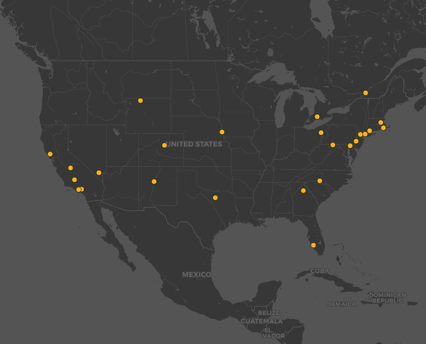

# Lab 2: Geo-tagged tweet collection and visualization
#### Stream Tweets by Donald Trump ID  

**Participant:** Yihang (Tina) Sun
**Instructor:** Bo Zhao
**Course:** GEOG458

> This lab collects Geo-tagged of [Donald Trump Twitter User ID](https://twitter.com/realDonaldTrump), **25073877**,  data using an API-based crawler for 300 seconds and visualize them on a map using a mapping tool QGIS. The map also zoomed and focused within the United States.

###Image of the Map

The map is displaying the geo-location of the data with tag *#realDonaldTrump* in the United States, which are crawled in 300 seconds. Because the density and frequency of the geo-tagged comparing to all the data is too small, the data come out is not too large but just enough to be analyzed. From the map, the most of the dots are locating in northeast and southwest. There are several hypothesises on the distribution and quantity of the data on this map:
+ COVID-19 impacts on overall
+ COVID-19 influences the most in California and New York Areas
+ Demoracts and Republicans
+ Stay Home order
+ High expectation on the President
+ Time consume
+ Public health advices
+ Donald Trump Personal influences
